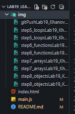

# Введение в JavaScript.

## Основная информация
**ФИО:** Ханов Владислав
**Группа:** ИСП-231
**Дата:** 18.03.2026

## Описание
В ходе лабораторной работы было изучено:
- Подключение JavaScript к HTML
- Базовый синтаксис JavaScript
- Циклы: for, while, do...while
- Операторы break и continue
- Вложенные циклы
- Функции: классическое объявление, функции как значения, стрелочные функции
- Параметры по умолчанию
- Массивы и методы работы с ними: push, pop, indexOf, includes
- Циклы для перебора массивов: for, for...of
- Объекты: создание, свойства, методы
- Перебор свойств объектов с помощью for...in
- Вложенные объекты и массивы

Проведено сравнение синтаксиса и возможностей JavaScript с языком C#.

## Структура проекта
